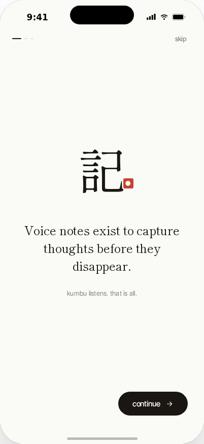
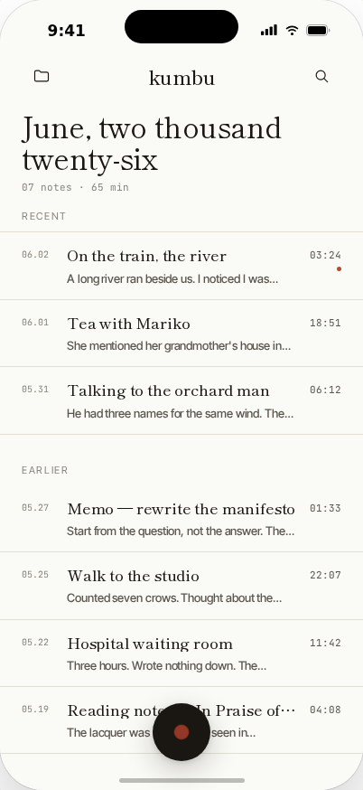
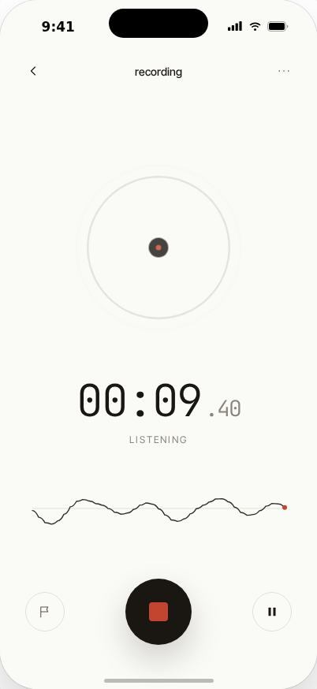
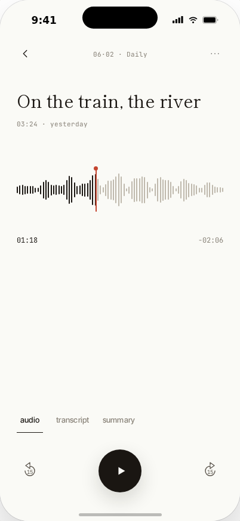
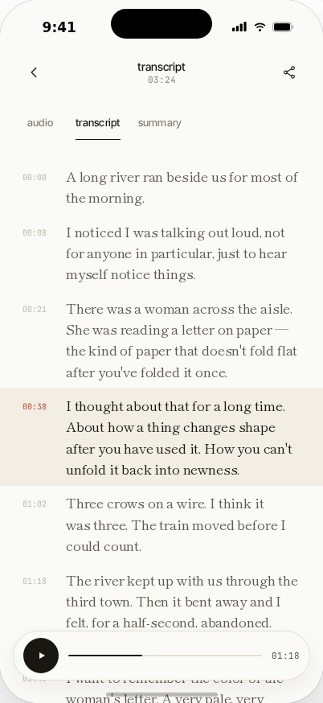
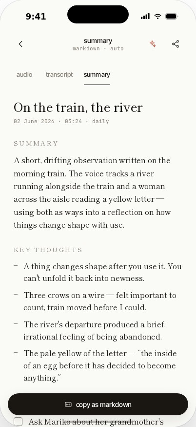
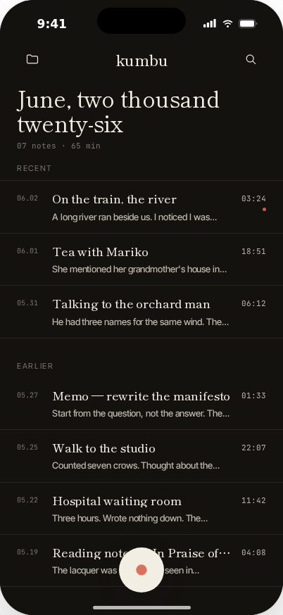
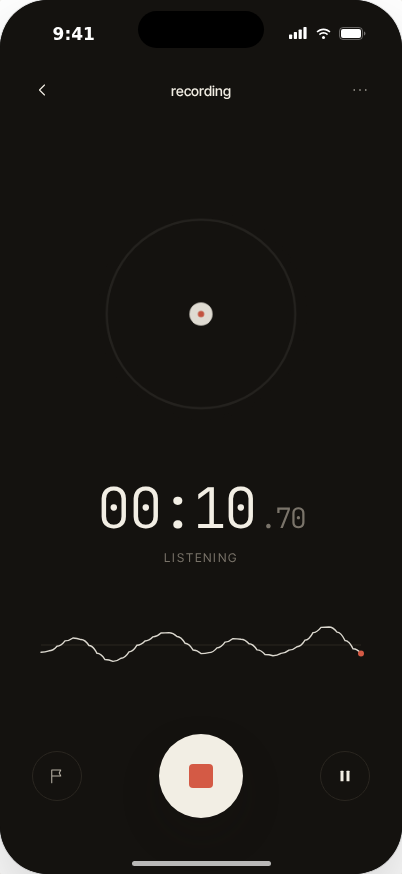

<p align="center">
  
</p>

<h1 align="center">kumbu</h1>

<p align="center">
  <strong>記憶 — memory, kept softly.</strong>
</p>

<p align="center">
  A voice note app that captures your thoughts, transcribes them, and distills what matters — built with React Native.
</p>

<p align="center">
  
  
  
  
</p>

---

## Philosophy

> *Voice notes exist to capture thoughts before they disappear.*
> *Read what you said, or a summary written for you.*
> *Keep only what matters; the rest quietly returns to silence.*

kumbu is built around three ideas — **記 Capture**, **聴 Listen**, **残 Keep** — turning fleeting spoken thoughts into organized, searchable knowledge.

---

## Screenshots

<p align="center">
  
  &nbsp;&nbsp;
  
  &nbsp;&nbsp;
  
  &nbsp;&nbsp;
  
</p>

<p align="center">
  
  &nbsp;&nbsp;
  
  &nbsp;&nbsp;
  
  &nbsp;&nbsp;
  
</p>

<p align="center">
  <sub>Onboarding &nbsp;·&nbsp; Home &nbsp;·&nbsp; Recording &nbsp;·&nbsp; Playback &nbsp;·&nbsp; Transcript &nbsp;·&nbsp; Summary &nbsp;·&nbsp; Night mode</sub>
</p>

---

## Features

### Voice Recording
- Full-screen recording interface with live waveform visualization
- Play, pause, and mark important moments during capture
- Timer with millisecond precision

### Transcription
- Automatic speech-to-text with time-synced segments
- Interactive transcript with text-to-speech playback
- Multi-language support (English, Japanese, auto-detect)
- Optional speaker detection for multi-speaker recordings

### AI Summaries
- Markdown-formatted summaries with configurable length (terse / brief / detailed)
- Supports headings, bullet lists, todo checklists, blockquotes, and tags
- Streaming reveal animation, regenerate with a single tap

### Organization
- Custom folders with kanji icons (daily, people, field, work, reading)
- Tagging system with optional AI-powered auto-tagging and auto-titling
- Full-text search across transcripts, summaries, and tags

### Export & Sharing
- Export as Markdown, plain text, audio (.m4a), or PDF
- Share to Obsidian, Notion, AirDrop, Mail, iCloud, and more

### Accessibility
- Paper (light) and Night (dark) themes
- Adjustable type scale (small, regular, large)
- AAA contrast mode
- Respects system reduce-motion preferences
- Haptic feedback

### Privacy
- End-to-end encryption enabled by default
- iCloud sync support
- Configurable auto-delete

---

## Tech Stack

| Layer | Technology |
|-------|-----------|
| Framework | React Native 0.85 · New Architecture (Fabric + TurboModules) |
| Language | TypeScript 5.9 |
| Navigation | React Navigation (native-stack) |
| Audio | react-native-nitro-sound |
| Animation | react-native-reanimated · react-native-worklets |
| Storage | react-native-mmkv (encrypted key-value) |
| TTS | react-native-tts |
| Graphics | react-native-svg |
| Testing | Jest · Testing Library |

---

## Getting Started

### Prerequisites

- Node.js >= 22.11
- Ruby >= 2.6.10
- Xcode (iOS) or Android Studio (Android)
- [React Native environment setup](https://reactnative.dev/docs/set-up-your-environment)

### Install

```sh
npm install
```

### iOS

```sh
bundle install
cd ios && bundle exec pod install && cd ..
npm run ios
```

### Android

```sh
npm run android
```

### Development

```sh
# Start Metro bundler
npm start

# Run tests
npm test

# Lint
npm run lint
```

---

## Project Structure

```
src/
├── assets/          # Fonts
├── components/      # Reusable UI primitives and audio visualizations
├── contexts/        # React Context providers (Notes, Settings)
├── hooks/           # Custom hooks (audio, TTS, permissions)
├── navigation/      # Stack navigator configuration
├── screens/         # 11 app screens
├── services/        # Storage, TTS, and audio services
├── theme/           # Design tokens, color palettes, typography
├── types/           # TypeScript type definitions
└── utils/           # Date formatting, helpers
```

---

## Design

kumbu's visual identity draws from Japanese typography and minimalist design:

- **Serif**: ShipporiMinchoB1 — elegant Japanese serif
- **Sans**: InterTight — modern, space-efficient
- **Mono**: JetBrainsMono — technical text
- **Palette**: warm paper tones with a coral-red hanko accent (#C4452F)

---

## License

This project is proprietary. All rights reserved.
